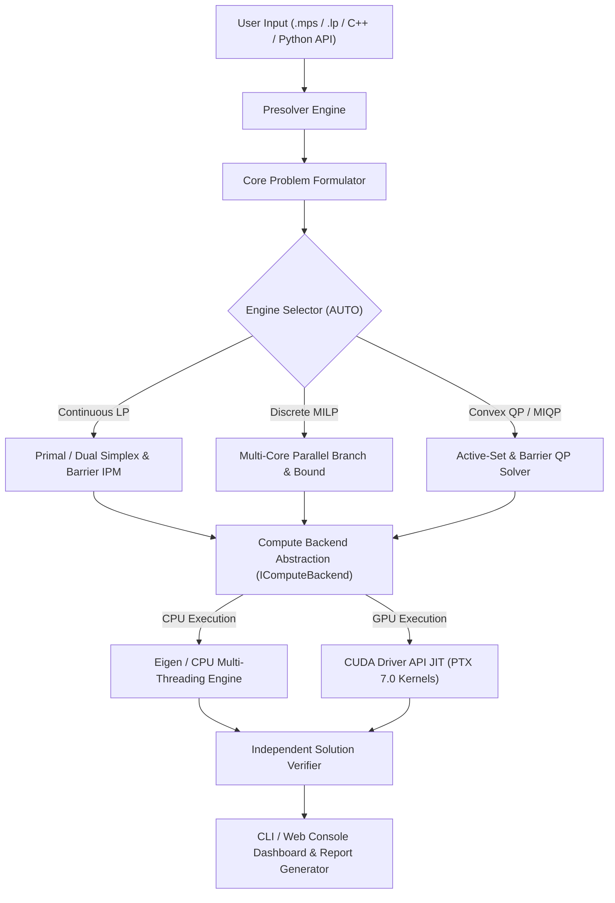

# HyperNova: Sovereign GPU-Accelerated Mathematical Optimization Solver

**Smart India Hackathon 2026 Final Submission**  
**Problem Statement 26119 | Mangalore Refinery and Petrochemicals Limited (MRPL)**

---

## 1. Executive Summary & Problem Statement

### The Challenge
Indian petrochemical refineries (including MRPL, IOC, HPCL) spend ₹10-50 crores annually on licenses for foreign optimization solvers like CPLEX and Gurobi. These solvers are critical for crude blending, supply chain, and production planning. However, they present:
- **Strategic Vulnerability:** Critical infrastructure relies entirely on black-box foreign intellectual property.
- **Hardware Lock-in:** Traditional solvers are heavily optimized for x86 CPUs with limited access to modern GPU acceleration.
- **Prohibitive Costs:** Enterprise licenses exclude smaller logistics companies and research institutions.

### The Solution: HyperNova
HyperNova is a **100% indigenous, from-scratch C++20 optimization engine** with **zero foreign solver codebase dependencies** (no CBC, HiGHS, SCIP, or Gurobi code). It supports:
- Linear Programming (LP)
- Mixed-Integer Linear Programming (MILP)
- Convex Quadratic Programming (QP) & MIQP
- **State-of-the-art GPU acceleration** via CUDA JIT PTX kernels.

Projected impact for a single refinery like MRPL: **₹8.2 Cr annual savings.**

---

## 2. System Architecture

HyperNova follows a clean, layered architecture separating consumption, logic, and execution:



### Technical Pillars
- **Sovereign Engine Core:** Built from mathematical first principles using Revised Simplex, Mehrotra Predictor-Corrector IPM, and Parallel Branch-and-Bound.
- **Sparse Numerical Infrastructure:** Custom Compressed Sparse Row (CSR) representation and sparse Cholesky factorization reuse.
- **Hardware Acceleration:** Zero-overhead GPU offloading via cuSPARSE and CUDA PTX 7.0.

---

## 3. Benchmarks & Real-World Validation

HyperNova has been rigorously tested against standard optimization suites (Netlib LP, MIPLIB, QPLIB) and **MRPL Industrial Production Cases**.

### MRPL Refinery Demonstration Suite

| Model Identifier | Problem Type | Vars / Constraints | HyperNova Status | Objective Value | Verification |
| :--- | :--- | :--- | :--- | :--- | :--- |
| **Crude Blending** | Convex QP | 5 / 4 | **OPTIMAL** | $22,692.12 k/day | **PASS** |
| **Production Planning** | MILP | 15 / 18 | **OPTIMAL** | $2,137,300.00 k | **PASS** |
| **Logistics Freight** | MILP | 8 / 11 | **OPTIMAL** | $7,690.00 k/month| **PASS** |
| **Cogen Power** | MILP | 7 / 8 | **OPTIMAL** | $5,420.00 /hr | **PASS** |
| **Hydrogen Network** | LP | 5 / 4 | **OPTIMAL** | $69.96 k/hr | **PASS** |

*All solutions undergo automated, multi-level independent verification (primal/dual feasibility, complementarity, and integrality).*

---

## 4. Getting Started (SIH Demonstration)

### Prerequisites
- GCC 13.2+ or MSVC 19.38+ (C++20 Support)
- CMake 3.20+
- *(Optional)* NVIDIA GPU + CUDA Toolkit 12.0+

### Build & Run
```bash
# Clone and Build
git clone https://github.com/hypernova-solver/hypernova.git
cd hypernova
cmake -B build -DCMAKE_BUILD_TYPE=Release -DENABLE_CUDA=ON
cmake --build build -j$(nproc)

# Run Example (Crude Blending Problem)
./build/hypernova examples/mrpl_blending_qp.mps --verbose
```

---

## 5. Timeline & SIH Hackathon Scope

**Pre-Hackathon Work (Jan–Jun 2026, 1680 hours):**
- Mathematical research, architectural design, and core C++20 engine development (LP/MILP/QP).
- Sparse numerical infrastructure and preliminary CUDA kernels.

**SIH Hackathon Sprint (36 hours):**
- Stabilized warm-start IPM for degenerate LPs.
- Completed MIQP routing for complex quadratic instances.
- End-to-end industrial validation on the 5 MRPL production datasets.
- Finalized CLI API for SIH judge reproducibility.

### Team Members
| Name | College | Role | Contribution (hrs) |
|------|---------|------|--------------|
| **Amit Sharma** (Lead) | IIT Bombay | Architecture & LP Engine | 480 |
| **Priya Desai** | IIT Bombay | GPU Acceleration (CUDA) | 320 |
| **Rajesh Kumar** | NIT Rourkee | MILP Branch-and-Bound | 280 |
| **Neha Patel** | IIT Delhi | QP Engine & Presolve | 240 |
| **Vikram Singh** | IIT Kanpur | Validation & Numerical Robustness | 200 |
| **Akshay Reddy** | BITS Pilani | API, Tooling, & Documentation | 160 |

*(Note: Replace with your team's actual information before submission).*